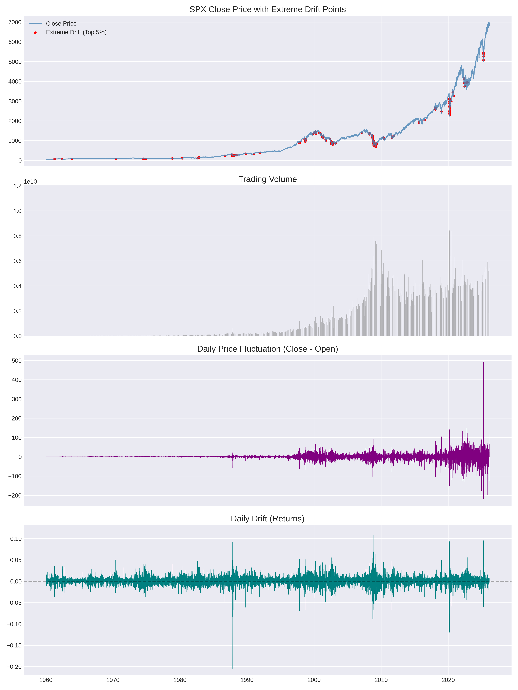

## 🚀data_pipline
This parts covers the entire pipeline from data acquisition to pre-training, providing detailed analysis and visualization for each step. This is an example of SPX stock price data.

### 📈📈📈📈📈Download the data
```bash
python3 download_data.py --ticker ^GSPC --period max --interval 1d
```
#### 🛠️**ticker**

Specifies the financial instrument to download.

^GSPC — S&P 500 Index

^N225 — Nikkei 225 Index

SPY — S&P 500 ETF

AAPL — Apple Inc. stock


#### 🛠️**interval**
Defines the time frequency of the downloaded data.

1d — Daily data, Maximum available history

1wk — Weekly data, Maximum available history

1mo — Monthly data, Maximum available history

1h — Hourly data, Last 730 days

5m — 5-minute data, Last 60 days

2m — 1-minute data, Last 60 days

1m — 1-minute data, Last 7 days

The downloaded data will be saved under `raw_data/`, and all variables will be visualized and stored in `raw_figures/`. 


**Figure 1.** Daily OHLCV variables of the S&P 500 Index. The Close/High/Low/Open prices appear very similar while the volume exhibits different.


### 📈📈📈📈📈Observe the data
We can calculate the basic status of the raw data:

| Variable    | Count  | Mean      | Std       | Min  | 1%   | 5%   | 50%    | 95%     | 99%     | Max     | Skew  | Kurtosis |
|------------|--------|----------|----------|------|------|------|--------|----------|----------|----------|--------|----------|
| Adj_Close  | 24651  | 723.39   | 1236.89  | 4.40 | 7.70 | 10.07| 103.53 | 3807.70 | 5925.29 | 6978.60 | 2.53   | 6.73     |
| Close      | 24651  | 723.39   | 1236.89  | 4.40 | 7.70 | 10.07| 103.53 | 3807.70 | 5925.29 | 6978.60 | 2.53   | 6.73     |
| High       | 24651  | 727.40   | 1243.20  | 4.40 | 7.70 | 10.07| 104.37 | 3838.19 | 5955.84 | 7002.28 | 2.53   | 6.71     |
| Low        | 24651  | 718.82   | 1229.64  | 4.40 | 7.70 | 10.07| 102.68 | 3782.19 | 5872.95 | 6963.46 | 2.53   | 6.75     |
| Open       | 24651  | 723.25   | 1236.69  | 4.40 | 7.70 | 10.07| 103.54 | 3810.70 | 5920.21 | 7002.00 | 2.53   | 6.73     |
| Volume     | 24651  | 9.68e8   | 1.68e9   | 0.00 | 0.00 | 0.00 | 2.21e7 | 4.57e9  | 6.28e9  | 1.15e10 | 1.75   | 2.18     |
<p align="center">
  <b>Table 1.</b> Descriptive Statistics (GSPC_1d)
</p>

Based on our observations, we can draw several key conclusions:
1.  As shown in Figure 1, the price metrics (Close, High, Low, and Open) appear nearly identical. Furthermore, the data prior to 1960 is excessively flat. Consequently, we may want to truncate the dataset to start from 1960 and focus on Close and Volume as our primary effective data points.
2.  Both the Kurtosis/Skewness statistics in Table 1 and the line chart in Figure 1 indicate that the SPX stock data exhibits a sharp, rightward upward trend, with a distribution spanning a price range of over 6,000. Therefore, when analyzing volatility factors or performing anomaly detection, it may be necessary to isolate the Trend component.
3.  By calculating the difference between the Close and Open features, we can derive a supplementary feature representing daily price fluctuations.

### 📈📈📈📈📈 Data cleaning
```bash
python3 data_cleaning.py --input raw_data/GSPC_max_1d.csv --out_dir clean_data/GSPC_1d
```
Following our initial observations, we have truncated the dataset to include only Close and Volume data from 1960 onwards. Additionally, we calculated the daily difference between Open and Close prices to serve as a supplementary feature for volatility analysis.

Beyond basic truncation, we implemented standard Data Cleansing procedures. A primary example is our approach to extreme drift detection: we calculate the daily price drift and highlight the top 5% of dates with the highest drift in red. 
> **Note:** While this serves as a preliminary form of Anomaly Detection, we aim to handle these outliers more rigorously using various Machine Learning techniques during the model_pipeline stage.

<p align="center">
 
</p>

**Figure 2.** Visualization of Cleaned Dataset. From top to bottom: Close Price, Trading Volume, Price Fluctuation (Open-Close difference), and Daily Drift (Returns). In the uppermost Price plot, the points highlighted in red represent the top 1% of extreme drift events.

At this point, the cleaned dataset and the corresponding plots have been saved to: 
```bash
clean_data/GSPC_1d
```
### 📈📈📈📈📈Data Analysis
I will demonstrate several example methods for analyzing financial time-series data.

#### 🛠️ **Part I: Decompose is very useful!**
```bash
 % python3 data_analysis_decompose.py \
    --csv clean_data/GSPC_1d/GSPC_cleaned.csv \
    --out_img decompose_data/stl_spx.png \
    --out_csv decompose_data/stl_spx.csv \
    --period 252 \
```

We employ the STL (Seasonal and Trend decomposition using Loess) method to decompose the time-series data.
Alternative approaches such as Empirical Mode Decomposition (EMD) could also be applied; however, these methods require additional frequency-domain interpretation to determine whether each decomposed component should be categorized as trend or noise. Since our dataset consists of daily observations, the seasonal period is set to 252, corresponding to the approximate number of trading days in one year. 
