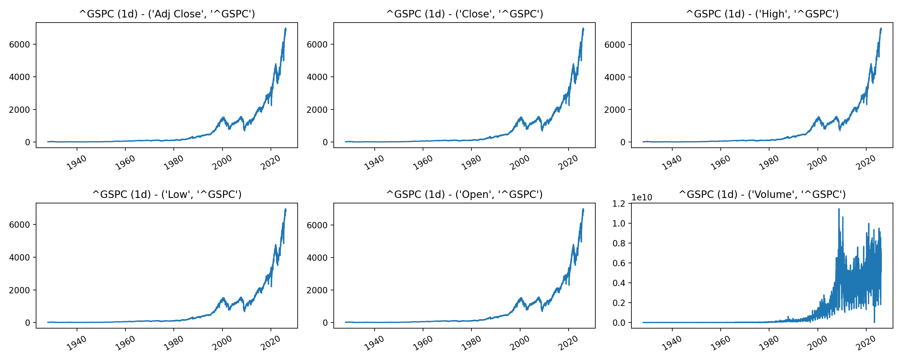

## data_pipline
This parts covers the entire pipeline from data acquisition to pre-training, providing detailed analysis and visualization for each step

### Download the data
```bash
python3 download_data.py --ticker ^GSPC --period max --interval 1d
```
#### ticker

Specifies the financial instrument to download.

^GSPC — S&P 500 Index

^N225 — Nikkei 225 Index

SPY — S&P 500 ETF

AAPL — Apple Inc. stock


#### interval
Defines the time frequency of the downloaded data.

1d — Daily data, Maximum available history

1wk — Weekly data, Maximum available history

1mo — Monthly data, Maximum available history

1h — Hourly data, Last 730 days

5m — 5-minute data, Last 60 days

2m — 1-minute data, Last 60 days

1m — 1-minute data, Last 7 days

The downloaded data will be saved under `raw_data/`, and all variables will be visualized and stored in `raw_figures/`. 



**Figure 1.** Daily OHLCV variables of the S&P 500 Index. The Close/High/Low/Open prices appear very similar while the volume exhibits different.


### Analysis the data
```bash
python3 data_analysis.py --input raw_data/GSPC_max_1d.csv --out_dir analysis/GSPC_1d
Range: 1927-12-30 -> 2026-02-20 | Rows: 24651 | Freq guess: daily_or_less
Columns (6): ['Adj_Close', 'Close', 'High', 'Low', 'Open', 'Volume']

[Preview head]
            Adj_Close      Close       High        Low       Open  Volume
Price                                                                    
1927-12-30  17.660000  17.660000  17.660000  17.660000  17.660000       0
1928-01-03  17.760000  17.760000  17.760000  17.760000  17.760000       0
1928-01-04  17.719999  17.719999  17.719999  17.719999  17.719999       0
1928-01-05  17.549999  17.549999  17.549999  17.549999  17.549999       0
1928-01-06  17.660000  17.660000  17.660000  17.660000  17.660000       0

[Preview tail]
              Adj_Close        Close         High          Low         Open      Volume
Price                                                                                  
2026-02-13  6836.169922  6836.169922  6881.959961  6794.549805  6834.270020  5718360000
2026-02-17  6843.220215  6843.220215  6866.990234  6775.500000  6819.859863  5418480000
2026-02-18  6881.310059  6881.310059  6909.120117  6849.660156  6855.479980  5098160000
2026-02-19  6861.890137  6861.890137  6879.120117  6833.060059  6861.339844  5151690000
2026-02-20  6909.509766  6909.509766  6915.859863  6836.330078  6843.259766  5432480000

[Missingness top 5]
           missing_count  missing_ratio
Adj_Close              0            0.0
Close                  0            0.0
High                   0            0.0
Low                    0            0.0
Open                   0            0.0
```
